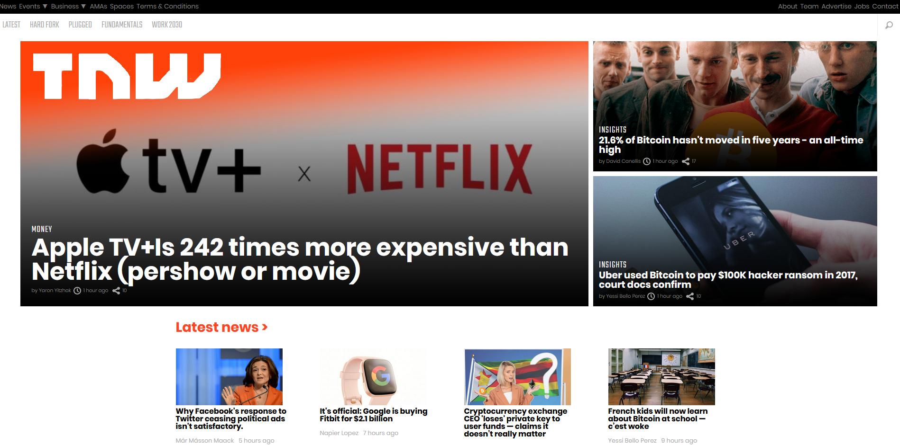

# TNW-Clone-Gwen-and-Ara
## Table Of Contents

* [About the project](#about-the-project)
* [Technologies](#technologies)
* [Acknowledgements](#acknowledgements)
* [About us](#about-us)

## About the project

This project was built by Gwen and Ara for the 6th project in the Microverse program. It is built with HTML and CSS using pair programming and the driver/navigator method. This project is a clone of The Next Web found at https://thenextweb.com/ .

## Technologies
<!--Add more technologies HERE-->
The technologies we used were Github, VSCode, HTML/CSS, Stickler, and Styleint.

## Acknowledgements

We used the refences from the ODIN PROJECT website for technical information, as well as W3 schools, the New York Times, and the mozilla docs for the same.

<!--We used free icon packs downloaded from https://www.iconfinder.com/ for the images in our project page.-->
We also used the refences from the ODIN PROJECT website for technical information, as well as W3 school and the mozilla docs for the same.

## About us

OUR GITHUB PROFILES
* Gwen Hey - [Link](https://github.com/HeyItsGwen)
* Ara Camarillo - [Link](https://github.com/aracelicaes)

OUR LINKEDIN PROFILES
* Ara Camarillo - [Link](https://www.linkedin.com/in/ara-camarillo-7297799b/
)
* Gwen Hey - [Link](https://www.linkedin.com/in/gwen-hey-642109191/)